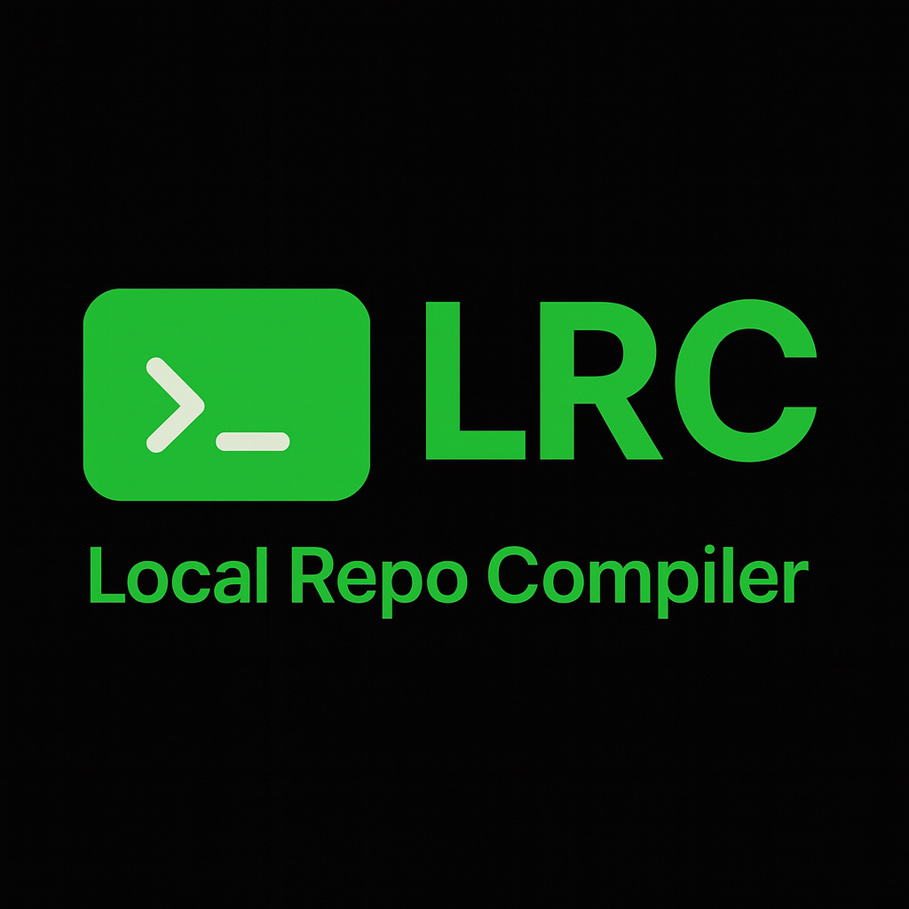

<p align="center">
  
</p>

# ⚙️ LRC — Local Repo Compile

**LRC** lets you build full project repositories from simple, declarative text schemas — directly from your terminal.

Cross-platform support for **Linux**, **macOS**, **Windows**, **WSL2**, and **Android/Termux**.

---

## 🚀 Quick Start

### 🧩 Installation

#### **Method 1 — Clone & Install**
```bash
git clone https://github.com/Justadudeinspace/lrc.git
cd lrc
chmod +x install_deps.sh
./install_deps.sh
```
Method 2 — Manual Install
```python
pip install -e .
```
Method 3 — System-Wide Bootstrap
```python
python3 lrc --bootstrap
```

---

## 💡 Basic Usage

1️⃣ Create a Schema File

myproject.lrc
```
# Project: My Awesome Project
# Description: Example project

@set AUTHOR=YourName
/src
  main.py -> print("Hello ${AUTHOR}!")
README.md <<MD
# ${PROJECT}
Created by ${AUTHOR}
MD
```
2️⃣ Generate the Project
```python
lrc myproject.lrc
```

---

## 📜 Schema Language Reference

🧱 Comments & Metadata
```
# Project: My Project
# Description: Simple demo
# Version: 1.0.0
```
⚙️ Variables
```
@set AUTHOR=YourName
@set EMAIL=your@email.com
```
Use variables anywhere with ${VARIABLE} — in paths or content.


---

## 🧾 File Creation Patterns

Empty file
```
main.py
```
Inline content
```
config.json -> {"key": "value"}
```
Multi-line (Heredoc)
```
script.py <<PY
#!/usr/bin/env python3
print("Hello World")
print("Multi-line content")
PY
```

---

## 📐 Directives

Directive	Description

```
@set KEY=VALUE	Define variables
@ignore pattern	Ignore paths matching pattern
@template name	Use built-in template (python-cli, node-cli, rust-cli)
@chmod path +x	Make file executable
@include file	Include another schema file
@copy src dest	Copy existing files
@symlink target link	Create symbolic links
```


---

## 🗂️ Directory Structure Example

```
/root-dir
  /src
    main.py -> print("Hello World")
  docs/
    README.md -> # Docs
```

---

## 🧰 CLI Reference

lrc SCHEMA_FILE [OPTIONS]

```python
Options:
  -n, --dry-run        Preview actions only (no writes)
  -f, --force          Overwrite existing files
  -o, --out DIR        Set custom output directory
  -v, --verbose        Enable detailed logs
  -b, --bootstrap      Install system-wide command
  --version            Show version info
  -h, --help           Display help message

🔍 Examples

lrc myproject.lrc                 # Generate project
lrc myproject.lrc -o ./output     # Custom output directory
lrc myproject.lrc --dry-run       # Preview only
lrc myproject.lrc --force         # Overwrite existing files
lrc --bootstrap                   # Install system-wide
```

---

## ⚡ Command Usage Modes

### 🧩 Without Bootstrap (Development / Manual)

```python
# Install system-wide
python3 lrc --bootstrap

# Generate project
python3 lrc my_schema.lrc

# Dry-run preview
python3 lrc my_schema.lrc --dry-run --verbose

# Overwrite existing files
python3 lrc my_schema.lrc --force

# Show platform information
python3 lrc --platform-info
```

### 🚀 With Bootstrap (Installed System-Wide)

```python
# Basic usage
lrc myproject.lrc

# Custom output + verbose
lrc myproject.lrc -o ./output -v

# Preview only
lrc myproject.lrc --dry-run

# Overwrite existing files
lrc myproject.lrc --force

# Show platform details
lrc --platform-info

# Help
lrc --help
```

---

## 📚 Example Schemas

Located in /examples:

File	Description

```
schema_example.lrc	Minimal demo with all features
forgekit_schema_full.lrc	Complete project including tests, docs, and scripts
```


---

## 🧱 Templates

Pre-built starter templates:

Template	Description

```
python-cli	Python command-line tool
node-cli	Node.js CLI tool
rust-cli	Rust command-line tool
```


---

## 🧑‍💻 Development

```python
# Setup development environment
pip install -e ".[dev]"

# Run tests
pytest

# Static type checking
mypy src/

# Format code
black src/
```

---

## 🧩 System Dependencies

Install cross-platform dependencies for PDF and font support:

Platform	Command

```
Debian / Ubuntu / WSL2	sudo apt update && sudo apt install -y fonts-dejavu-core
Fedora	sudo dnf install -y dejavu-sans-mono-fonts
Arch	sudo pacman -Sy --noconfirm ttf-dejavu
macOS (Homebrew)	brew tap homebrew/cask-fonts && brew install --cask font-dejavu-sans-mono
Termux / Android	pkg install -y fonts-dejavu
Windows	Install “DejaVu Sans Mono” manually (falls back to Courier).
```


---

## ⚖️ License

MIT License — see [LICENSE](./LICENSE).


---

<p align="center"><b>LRC v1.0.0-Stable</b> — Designed by <b>JADIS (Justadudeinspace)</b></p>
<p align="center">Cross-platform. Declarative. Reproducible.</p>
```
---
